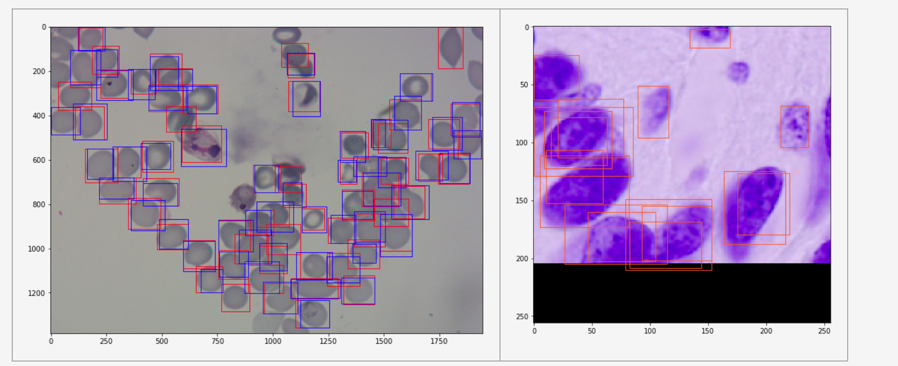
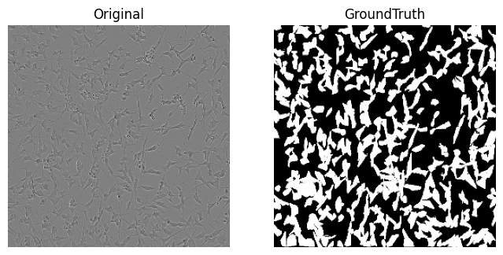

# cells-instance-segmentation

## Introduction

Cell microscopic imaging plays a vital role in biological and pharmaceutical studies. Accurate quantitification and delineation for cells in microscope images had been essential but labor-intense. Thresholding on a specific image is only helpful in detecting objects of high signal-to-noise. Unfortunately, the microscope images collected using phase contrast or differential interference contrast (DIC) have low contrast for cells, therefore is impossible to do cell quantitification and delineation with simple thresholding. Machine learning had been fruitful in computer vision in the past decades. Convolutional neural network (CNN) models had been proven effective in object detection out of images. Here, I deployed a U-Net CNN model for cell instance segmentation in microscope images. 

I collected nearly 2200 microscope images for the U-Net model training and evaluation. In detail, 32 fluorescence images of *Drosophila melanogaster* Kc167 cells stained for DNA (to visualize nucleus) and actin (to visualize cell cytoplasma) in BBBC007 dataset were downloaded from Broad Bioimage Benchmark Collection (https://bbbc.broadinstitute.org/BBBC007) together with their annotation, i.e. nucleus or cell outlines in a same size image. 

5 DIC images of human red blood cells together with their annotations in BBBC009 were downloaded from Broad Bioimage Benchmark Collection (https://bbbc.broadinstitute.org/BBBC009). 

168 fluorescence images of human colon cancer cell HT29 stained with Hoechst33342 for nucleus, phospho-histone H3 for mitosis, and phalloidin for actin in BBBC018 dataset were downloaded from Broad Bioimage Benchmark Collection (https://bbbc.broadinstitute.org/BBBC018) together with their outline annotations. 

60 images of human CHO cell together with their outline annotation were downloaded from (). 

1328 images of malaria infected human blood smear sample in BBBC041 were downloaded from Broad Bioimage Benchmark Collection (https://bbbc.broadinstitute.org/BBBC041/). Their annotations were rectangle boxes around each cell and the coordinates were stored in a json file. 

606 phase contrast images of neuron cells were downloaded from the Kaggle Sartorius Cell Segmentation website () together with run length encoded annotations in a csv file. 

