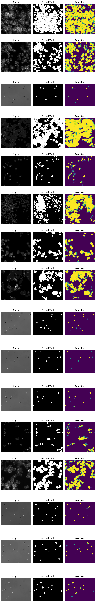

# cells-instance-segmentation

## Introduction

Cell microscopic imaging plays a vital role in biological and pharmaceutical studies. Accurate quantitification and delineation for cells in microscope images had been essential but labor-intense. Thresholding on a specific image is only helpful in detecting objects of high signal-to-noise. Unfortunately, the microscope images collected using phase contrast or differential interference contrast (DIC) have low contrast for cells, therefore is impossible to do cell quantitification and delineation with simple thresholding. Machine learning had been fruitful in computer vision in the past decades. Convolutional neural network (CNN) models had been proven effective in object detection out of images. Here, I deployed a U-Net CNN model for cell instance segmentation in microscope images. 

I collected nearly 2200 microscope images for the U-Net model training and evaluation. In detail, 32 fluorescence images of *Drosophila melanogaster* Kc167 cells stained for DNA (to visualize nucleus) and actin (to visualize cell cytoplasma) in BBBC007 dataset were downloaded from Broad Bioimage Benchmark Collection (https://bbbc.broadinstitute.org/BBBC007) together with their annotation, i.e. nucleus or cell outlines in a same size image. 

*Figure BBBC007 example. (Left) Fluorescence image of Kc167 stained for actin; (Right) Annotation.*

5 DIC images of human red blood cells together with their annotations in BBBC009 were downloaded from Broad Bioimage Benchmark Collection (https://bbbc.broadinstitute.org/BBBC009). 

*Figure BBBC009 example. (Left) DIC image of human red blood cells; (Right) Annotation.*

168 fluorescence images of human colon cancer cell HT29 stained with Hoechst33342 for nucleus, phospho-histone H3 for mitosis, and phalloidin for actin in BBBC018 dataset were downloaded from Broad Bioimage Benchmark Collection (https://bbbc.broadinstitute.org/BBBC018) together with their outline annotations. 

*Figure BBBC018 example. (Left) Fluorescence image of HT29 cells stained wit phalloidin for actin; (Right) Annotation.*

60 images of human CHO cell together with their outline annotation were downloaded from (). 

*Figure CHO example. (Left) Image of human CHO cells; (Right) Annotation.*

1328 images of malaria infected human blood smear sample in BBBC041 were downloaded from Broad Bioimage Benchmark Collection (https://bbbc.broadinstitute.org/BBBC041/). Their annotations were rectangle boxes around each cell and the coordinates were stored in a json file. 

*Figure BBBC041 example. (Left) Image of human blood smear; (Right) Box annotation.*

606 phase contrast images of neuron cells were downloaded from the Kaggle Sartorius Cell Segmentation website () together with run length encoded annotations in a csv file. 

*Figure Sartorius example. (Left) Phase contrast image of SHSY-5Y cells; (Right) annotation.*

## Deep neural model for cell objects segmentation: U-Net
U-Net employs convolutional and MaxPooling layers in the contracting state (feature extraction), and deconvolutional and pooling layers in the upsampling state to reach the original resolution.

## U-Net model training and testing

*Figure IoU of training and validation dataset.*

*Figure DICE of training and validation dataset.*

*Figure Testing results of UNet model. 16 images used in the test were showed as 'Original', their groundtruth as 'GroundTruth', and the model generated label as 'Predicted''.*

## Model deployment
An API interface has been built for the cell segmentation model by using FastAPI. 

## UI interface 
An UI frontend has been built by using streamlit. The streamlit server is hosted on Paperspace. However, it is not in running right now. 
